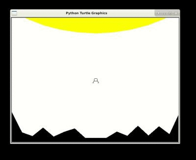

This new project extends the previous game: The lander will move not
only vertically but change its direction too, and we will implement
much larger levels.

## Exploring the world

Extend the keyboard handler so that the Left and Right keys change the
heading of your ship. You can also use the Up key to control the motor
instead of the space key. The motor thrust should change the deltax
and deltay of your ship depending on the heading.

You will need the [trigonometric
functions](https://docs.python.org/2/library/math.html#math.cos), from
the math module. Also, it's much easier if (0,0) is the center of your
lunar shape(s), as it is by default the rotation center when you change
the heading of your ship.

The game stops when the lander gets out of the screen. To change this,
define a ```isoob()``` function in your lander. You will find the
eg-anim.py example inspiring, but instead of bouncing on the walls as
in this example, you probably want to wrap around the world: when you
go too much to the left, you end up on the right of the screen. Make
sure that your ```isoob()``` always returns False: the engine will
delete your lander (and end the game) as soon as this method returns
True.

## Let it burn, let it burn

Checking on the lander altitude is not enough anymore to see if it
touches the sun, because the sun is not of the same height
everywhere. We could change our test, taking the ```x``` position into
account, but the engine provides a better way to deal with the
collisions, that will turn very helpful when we will add bullets and
enemies to our game (in the next project).

You can declare a function that is called for each pair of objects in
your game as follows:
``` python
def collision_cb_SL(sun, lander):
	# Do something useful
def collision_cb_LS(lander, sun):
	collision_cb_SL(sun, lander)
[...]
if __name__ == '__main__':
	[...]
	# Call collision_cb_SL() each step for each pair of {Sun, Lander}
	engine.register_collision(Sun, Lander, collision_cb_SL)
	# Call collision_cb_LS() each step for each pair of {Lander, Sun}
	engine.register_collision(Lander, Sun, collision_cb_LS)
```

It is really bothersome that the engine forces us to register both
functions, and you may want modify the engine to make it a bit more
cleaver and user friendly. But let's use it unmodified for a while...

The simplest way to detect whether two objects collide is to determine
whether the distance between them is smaller than the sum of their
radius.

In the asteroid and invader examples, every object is given a
```get_bc()``` function that returns the position and radius of the
object. The collision detection is then done by the
```iscoll_circle(obj1,obj2)``` function that calls this ```get_bc()```
on both objects. The function names are improvable, but the logic is
there.

In my code, I added a ```get_bounding_circle()``` to both my lander
and my sun, and then my ```collision_cb_SL()``` above uses a
```iscolliding_circle(obj1, obj2)``` that is similar to the
```iscoll_circle(obj1,obj2)``` of the examples.

``` python
# In my Lander
	def get_bounding_circle(self):
		# bounding circle, for circle-based collision detection
		return self.x, self.y, 8 # the radius of my lander shape is 8
```

I also made my sun much larger (and higher) so that it covers the
whole screen width. Since its center is out of screen, the engine
would remove it quickly, so I rewrote its isoob() function to always
return False. My rocket can move out of the screen on the upper
boundary, but it will hit the sun there, or soon move back on screen
so that's okay.



One conclusion of this section is that you are often free to change
the game rules when you program. I chose this engine because it is
simple enough for you to read and adapt on need, but you will probably
have to adapt a lot of software during your career as a
researcher. Always remember that this is a possibility, and use it
wisely.

## Touch down

Since the ground is far from being circular, we need another approach
to detect when the lander touches the ground. Instead, we need to
compute the highest ground point on the X interval currently occupied
by the lander. This can be computed by iterating over the points of
the shape. The code is a bit more complicated than what we've written
so far, but with a pen and paper (and the [Thales
theorem](https://en.wikipedia.org/wiki/Intercept_theorem)), you should
figure it out anyway.

To prepare this computation, my Ground looks as follows. I compute the
ymin and ymax of the interval at the same time because we can only
land on flat surfaces (where ```ymin==ymax```), so I will need both
information soon.

``` python
level1 = ((-320, 120), (-280, 41), (-240, 27), (-200, 59), (-160, 25),
  (-120, 43), (-80, 56), (-40, 20), (0, 20), (40, 20), (80, 44), (120, 28),
  (160, 66), (200, 29), (240, 64), (280, 34), (320, 120),(320, 0),(-320,0))
class Ground(engine.GameObject):
	points = None
	def __init__(self,points):
		self.points = points
		s = turtle.Shape("compound")
		s.addcomponent(points, "black", "black")
		turtle.register_shape('ground', s)
		super().__init__(0,-HEIGHT/2+2, 0, 0, "ground", "black")
	def heading(self):
		return 90
	def compute_yminmax(self, xmin, xmax):
		ymin = 0
		ymax = 0
		# Do the computation here using self.points
		return ymin,ymax
[...]
if __name__ == '__main__':
	global ground
	[...]
	ground = Ground( level1 )
```

And then write your collision functions for ```{Ground, Lander}``` and
```{Lander, Ground}``` using this.


Since the ground collision detection involves quite a lot of
computation, we could compute the ```ymin``` and ```ymax``` in advance for
each lunar ```x``` position, but it does not seem to be necessary on
my machine so I did not do it yet.

Always remember: premature optimization is the root of all evil -- Knuth.

## Longer, Deeper, Larger, Better

Your game is playable already, but it is very limited as the player
know the map very quickly. We will make it possible to explore larger maps
with a scrolling feature. The trick is simply that when the lander
position comes too close of a border, we change the position of the
ground and roof. While we are at it, we should change sun above for a
real roof: Such a large but close sun is already unrealistic for a
small map, and it will only become worse with larger maps. On the left
and right side, you could either keep the wrapping feature or
implement walls (it's your game after all).

## Cleanups, and other extensions

This is it, your game is almost done. Remember to clean it up before
moving to the next project: you will reuse your code again. So rename
and document your functions, sort them in a logical order and kill the
dead code. Print the documentation of your project with epydoc.


Then, when you want, move on to the next game project, [[OIDS]].