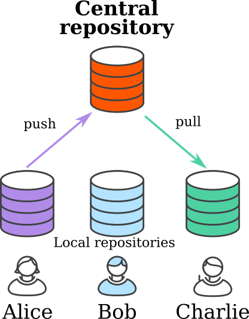
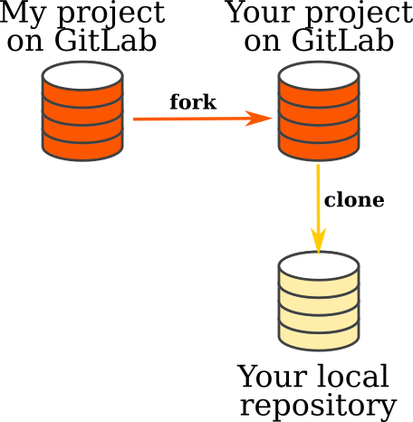

.. _git:

Git crash course
================

.. important::

  Remember that git is optionnal in this project. It is perfectly OK
  not not use git and use another approach if you ever need to
  synchronize your files.

Git is a wonderful tool to share some text between several computers,
while keeping track of the history of changes. This is incredibly
useful when working as a team on a programming project: when one team
member modifies a file (to add a feature), it clearly document the
change. She then pushes these changes on a shared project, from which
others can get these change. They do so by synchronizing their local
version with the shared project.

In the git parlance, each teamate has a **local repository**, a
given change is a **commit** (some modifications to the files + a description of
these changes), while synchronizations can be either **push** or **pull**,
depending whether you send local changes to a remote repository or get
remote commits to your local repository.

Git is so useful that I routinely use it on projects where I'm the
only programmer. Even if I don't have to synchronize with remote
computers, I like the ability to build my software incrementally by
adding one commit after another. When things go wrong, I can go back
to a previous working commit, just like you go back to the previous
checkpoint when you lose in a video game.

This page only shows the minimal commands that you need. It does not
show the full power of git, but hopefully will help you getting
started with git.

Configuring your account on GitLab
----------------------------------

A single configuration is mandatory to use our academic hosting system
(`ISTIC gitlab <https://gitlab.istic.univ-rennes1.fr/>`_) from your
computer.  First log into our `this system 
<https://gitlab.istic.univ-rennes1.fr/>`_ using your academic
credentials. Go to your preference (click on the round icon on the
very top right corner), then "SSH keys" on the left and follow the
instructions to generate a key on your computer (don't use a
passphrase). Once generated, copy/paste the content of the public part
of your key to the GitLab preference box.

Getting your copy of the retrogames
-----------------------------------

You are not allowed to modify the `template available online
<https://gitlab.istic.univ-rennes1.fr/mquinson/template-retrogames>`_,
so you first need to dupplicate it on ISTIC's gitlab, and then you
need to get a local copy on your disk. In the git parlance, you need
to **fork** my repository on gitlab, and then **clone** your fork onto
your local computer.

   
The difference between **clone** and **pull** is that clone is
creating a local repository after a remote one while pull is only
copying commits between compatible repositories.

In practice, go to the `project you want to fork
<https://gitlab.istic.univ-rennes1.fr/mquinson/template-retrogames>`_,
clic on the "fork" button to the right of the project name and follow
the instructions to make a private project.

Once you have your own fork, clic on the big blue "Clone" button and
select the ssh URL. Then, the following in a terminal:

.. code:: shell
 
   git clone #the URL of your project# retrogames
   
If your name is GIZMODO, you will probably type the following:

.. code:: shell

   git clone git@gitlab.istic.univ-rennes1.fr:GIZMODO/template-retrogames.git retrogames

If you want to share your work with a teamate (once you have a
teamate), add this person as a project member on GitLab (she will get
a mail to confirm). After clicking on the received link to confirm,
she can clone your repository just as you did above.

Editing a file
--------------

Edit the file README.md on your local copy to add your name on top.

Verify the change you did by typing ``git diff``. This lists all
changes, line by line. In this output, lines starting with a ``-`` are
removed by the change while lines starting with a ``+`` were added.

For example, the following output simply means that I changed the
first line of the file, changing ``Retrogames template files`` into
``Retrogame, by me``. The other lines (starting with `` ``) are
unchanged by this edition.

.. code:: diff

   --- a/README.md
   +++ b/README.md
   @@ -1,4 +1,4 @@
   -# Retrogames template files
   +# Retrogame, by me
    
    This is the student's starter kit for the Retrogaming project (https://mquinson.frama.io/retrogames).
    It contains all you need to start working on your project. 

Creating a commit
-----------------

To send this change to your project, you first need to create a commit
with the following command.

.. code:: shell

   git commit -m "Add my name" README.md

Here, ``git commit`` is what you want to do (create a git commit),
``-m "Add my name"`` documents the commit (ie, the string `Add my
name` will be used as a documentation to the change introduced, and
finally ``README.md`` asks git to only consider the changes of that
file.

If you type ``git diff`` again, the command yields no output, because
there is no file edition that is not already commited to your
repository.

Git will refuse to commit changes to files it does not track, so you
need to  **add new files** before you can commit them.

.. code:: shell

   # create newfile.py on disk
   git commit -m "something" newfile.py # This is an error 

   git add newfile.py # now git knows about this file
   git commit -m "something" newfile.py # no error
   

Synchronizing your repository
-----------------------------

Once you've created a commit, you need to explicitly send it to the
GitLab project as follows:

.. code:: shell

   git push

Your colleagues (if any) need to explicitly pull this commit from the
GitLab project as follows:

.. code:: shell

   git pull

Going further
-------------

There is much (much) more to say about git and gitlab, but you now
have the basics to get things done. Congratuations! 
But don't get fooled. Git is a powerful (and often tricky) tool. 

You will find many tutorials on the internet. `The one from Atlassian
<https://www.atlassian.com/git/tutorials/what-is-version-control>`_ is
very good and very complete. Thomas Genet (our colleague at Rennes)
provide `a very good one in French <http://people.irisa.fr/Thomas.Genet/GEN/CMs/cm4.pdf>`_ (`associated
video <https://video.univ-rennes1.fr/videos/cm4-quelques-outils-pour-le-genie-logiciel/>`_).
There is even `a little game <https://learngitbranching.js.org/>`_
that you can play in your browser to learn to use git. 